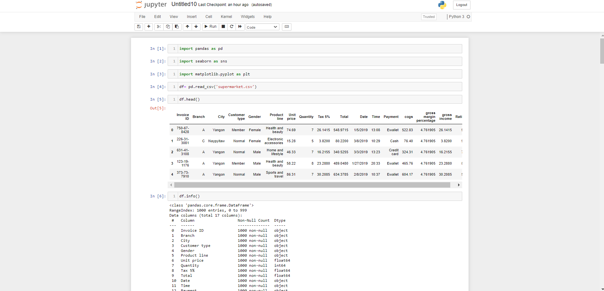
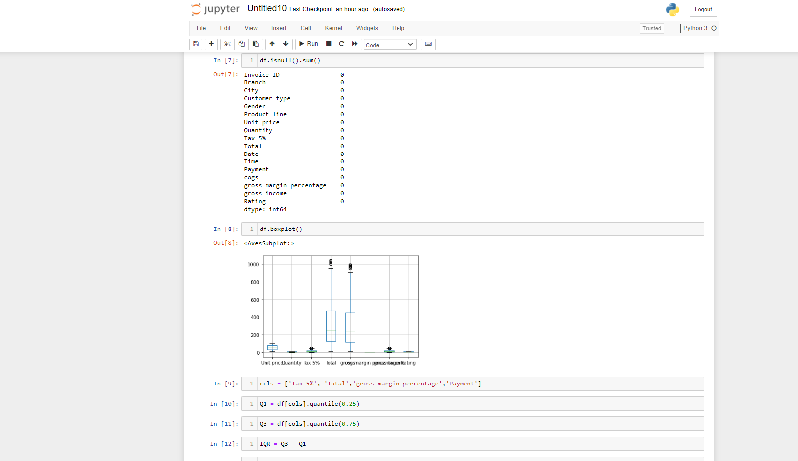
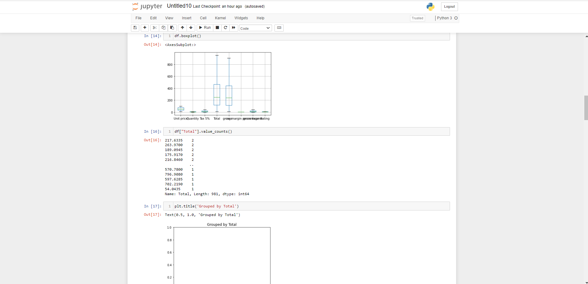
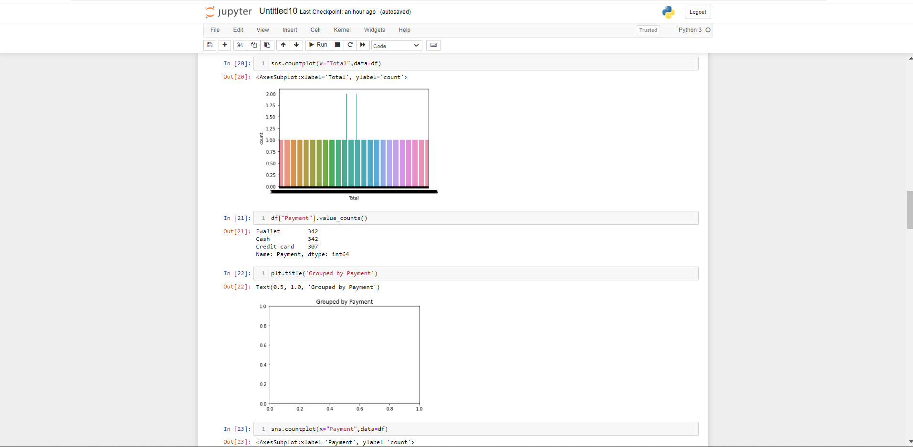
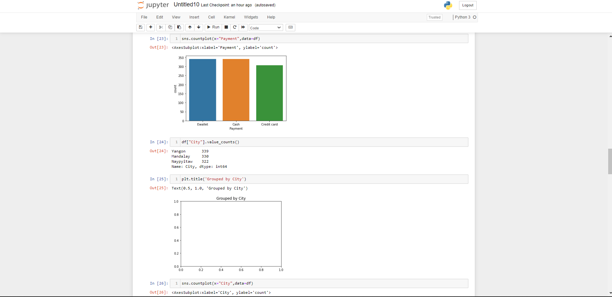
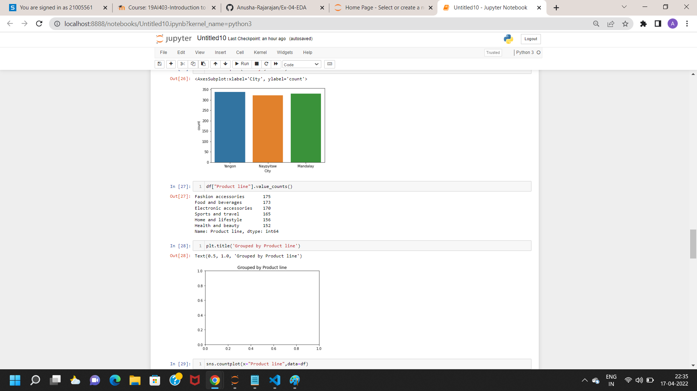
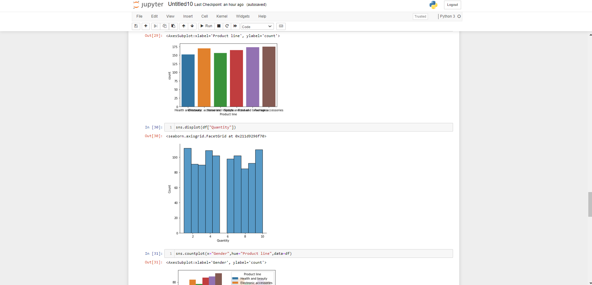
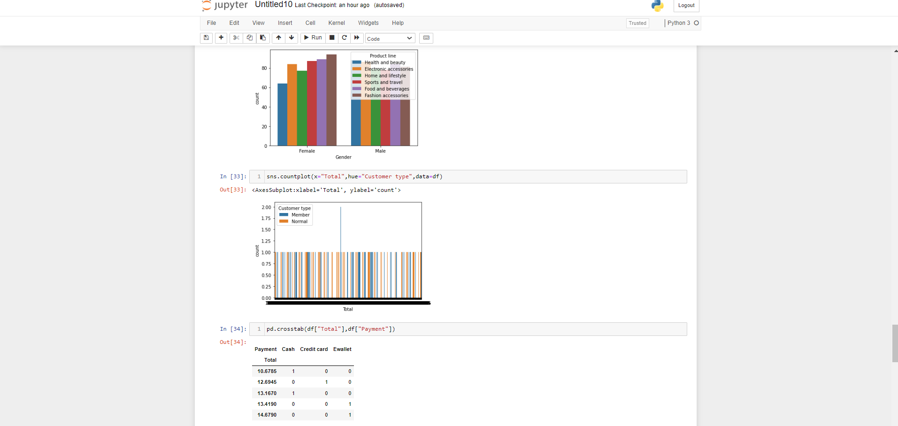
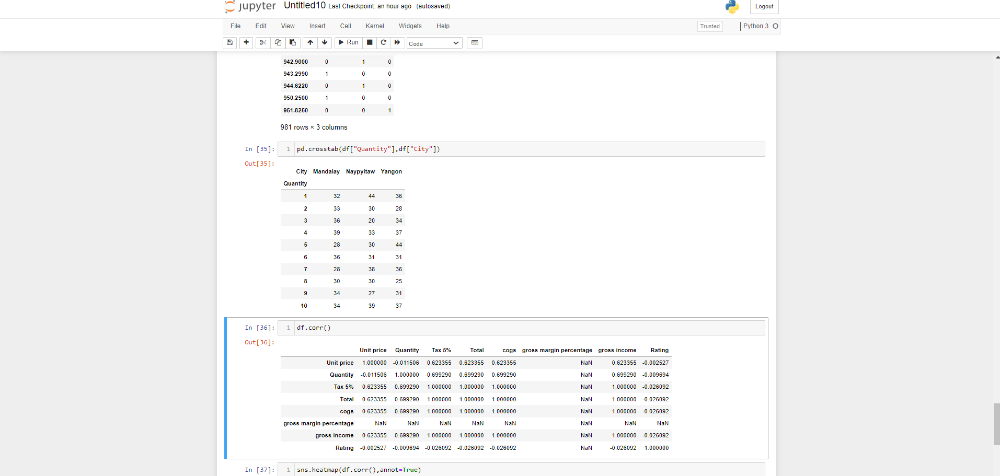
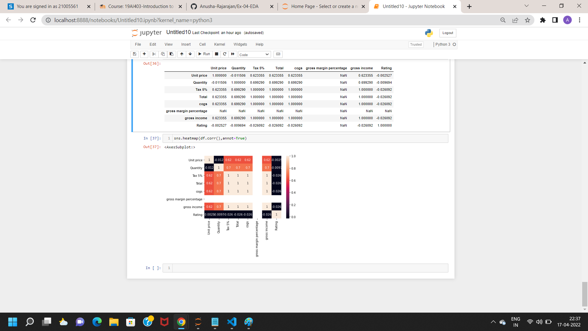

# Ex-04-EDA
# AIM:
To perform EDA on the given data set.

Explanation The primary aim with exploratory analysis is to examine the data for distribution, outliers and anomalies to direct specific testing of your hypothesis.

# ALGORITHM:
STEP 1 Import the required packages(pandas,numpy,seaborn).

STEP 2 Read and Load the Dataset

STEP 3 Remove the null values from the data and remove the outliers.

STEP 4 Remove the non numerical data columns using drop() method.

STEP 5: returns object containing counts of unique values using (value_counts()).

STEP 6: Plot the counts in the form of Histogram or Bar Graph.

STEP 7: find the pairwise correlation of all columns in the dataframe(.corr()).

STEP 8: Save the final data set into the file.

# CODE
~~~
Developed by VISMAYA.S 212221230125

import pandas as pd 
import seaborn as sns
import matplotlib.pyplot as plt
df= pd.read_csv('supermarket.csv')
df.head()
df.info()
df.isnull().sum()
df.boxplot()
cols = ['Tax 5%', 'Total','gross margin percentage','Payment']
Q1 = df[cols].quantile(0.25)
Q3 = df[cols].quantile(0.75)
IQR = Q3 - Q1
df = df[~((df[cols] < (Q1 - 1.5 * IQR)) |(df[cols] > (Q3 + 1.5 * IQR))).any(axis=1)]
df.boxplot()
df["Total"].value_counts()
plt.title('Grouped by Total')
sns.countplot(x="Total",data=df)
df["Payment"].value_counts()
plt.title('Grouped by Payment')
sns.countplot(x="Payment",data=df)
df["City"].value_counts()
plt.title('Grouped by City')
sns.countplot(x="City",data=df)
df["Product line"].value_counts()
plt.title('Grouped by Product line')
sns.countplot(x="Product line",data=df)
sns.displot(df["Quantity"])
sns.countplot(x="Gender",hue="Product line",data=df)
sns.countplot(x="Total",hue="Customer type",data=df)
pd.crosstab(df["Total"],df["Payment"])
pd.crosstab(df["Quantity"],df["City"])
df.corr()
sns.heatmap(df.corr(),annot=True)
~~~

# OUTPUT :

